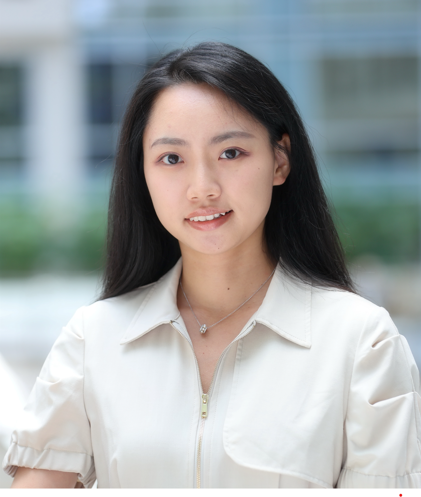

```{r setup, include=FALSE}
knitr::opts_chunk$set(echo = FALSE)
```


:::float-left



**Bio:** Bingyan Dai is a Ph.D. student in Applied Economics at Cornell University. She also holds a MS in Applied Economics and Management from Cornell University. Before going to Dyson School in 2019, she received her Bachelor of Economics in Finance and Bachelor of Management in Information Resource Management from Sichuan University. Dai conducts research in agricultural and resource economics, with special interests in bio-economics, decision-making under uncertainty, and supply chain management. 


:::


