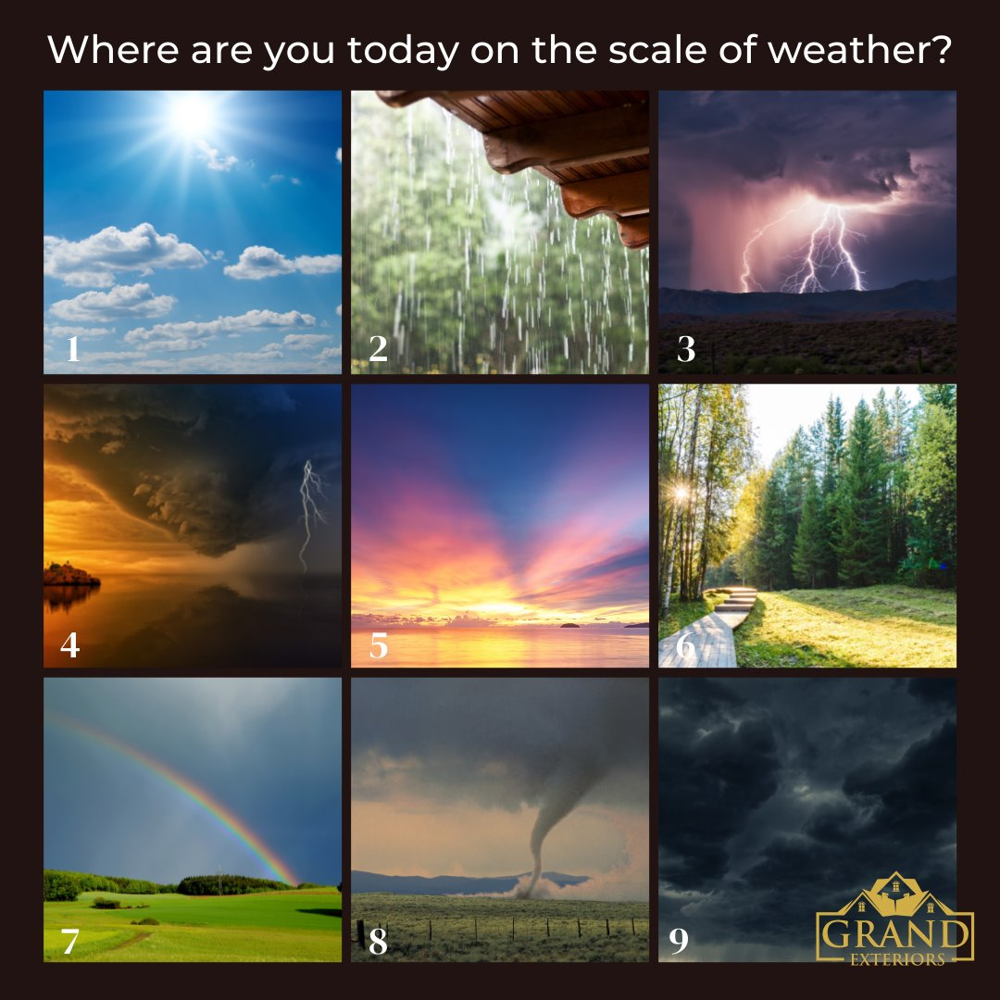

```{r setup, include=FALSE}
knitr::opts_chunk$set(echo = TRUE)
```

## Introductions

Welcome to our second breakout room! Now that we have shuffled the breakout rooms, let's start off with another quick icebreaker. 

Take a look at this 'weather-scale'. Each tile represents a different mood or feeling. 



Please introduce yourself by sharing:

- Your name

- The institution or organization you're affiliated with

- Your "weather score" – choose the weather that best represents how you feel today


## Session Overview 

In this part of our workshop, we have designed a series of role-play exercises to simulate real-world scenarios you might encounter throughout your research process. These scenarios will help us explore the utility and functionality of the prototype data discovery tool. Each scenario is crafted to highlight different aspects of the tool and how it can assist in various research activities such as finding collaborators, writing grants, doing the research and publishing.

**Session Goal:** To understand the tool's potential impact on your research workflows and decision-making processes. 

## Scenarios

Please follow along as we navigate through each scenario, reflecting on the specific questions and tasks presented.

<div class="row"> 
<div class="col-4"> <a href="collaborations.html" class="btn btn-primary btn-block">Find Collaborators</a> </div> 
<div class="col-4"> <a href="grants.html" class="btn btn-primary btn-block">Write Grants</a> </div> 
<div class="col-4"> <a href="research.html" class="btn btn-primary btn-block">Do the Research</a> </div> 
<div class="col-4"> <a href="publishing.html" class="btn btn-primary btn-block">Choose Publication Outlets</a> </div> 
</div>