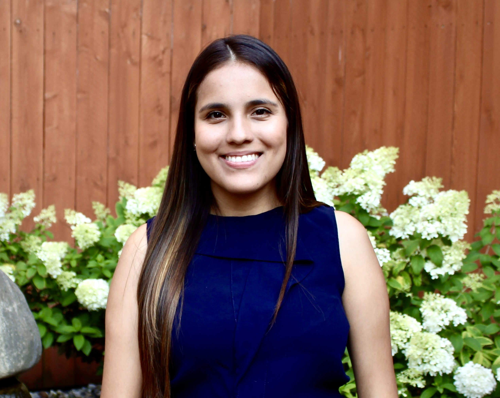

```{r setup, include=FALSE}
knitr::opts_chunk$set(echo = FALSE)
```


:::float-left



**Bio:** Camila Ulloa is a Ph.D. student in Horticulture and Landscape Architecture at Purdue University. She is dedicated to advancing the goals of the Diverse Corn Belt project, a five-year, multi-disciplinary research initiative. Camila is currently leading the design of surveys specifically tailored for various stakeholders in the thriving agricultural industry in the U.S. She thrives on challenges, particularly those related to addressing the economic viability of technologies and devising effective marketing strategies for diverse stakeholders.


:::


