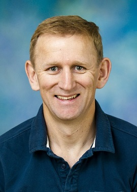

```{r setup, include=FALSE}
knitr::opts_chunk$set(echo = FALSE)
```


:::float-left



**Bio:** Aaron Smith is the DeLoach Professor of Agricultural and Resource Economics at the University of California, Davis, where he has been since 2001. Originally from New Zealand, he earned his PhD in Economics from the University of California, San Diego. His research addresses economic and policy challenges related to agriculture, energy, and the environment. He has over 50 publications in refereed journals, including outlets such as the Review of Economics and Statistics, the Journal of Econometrics, the American Journal of Agricultural Economics, and Proceedings of the National Academy of Sciences. His research has won the Quality of Communication, Quality of Research Discovery, and Outstanding American Journal of Agricultural Economics Article Awards from the Agricultural and Applied Economics Association and the Quality of Research Discovery Award from the European Association of Agricultural Economists. He is the cluster lead for socioeconomics and ethics in the AI Institute for the Food System (AIFS).

**Presentation Title:** Pending

**Abstract:** Pending


:::


