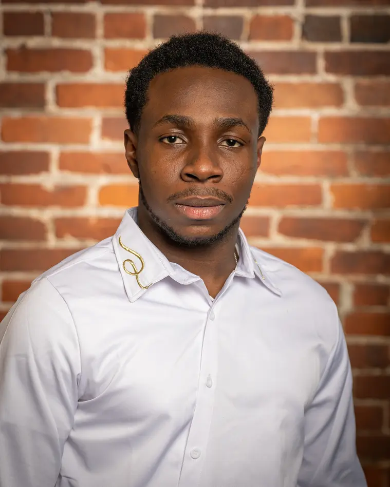

```{r setup, include=FALSE}
knitr::opts_chunk$set(echo = FALSE)
```


:::float-left



**Bio:** Love Jesjuwonlo Ayinde is an incoming master's student in data science and analytics at the University of Missouri. He recently graduated from Ohio Wesleyan University with a double major in Computer Science and Quantitative Economics. He mentors students as a Student Success Coach with AmeriCorps, teaching Mathematics and Computer Science. He also works with data analysis and strategic planning, including analyses of prices and sell-through rates. 


:::


