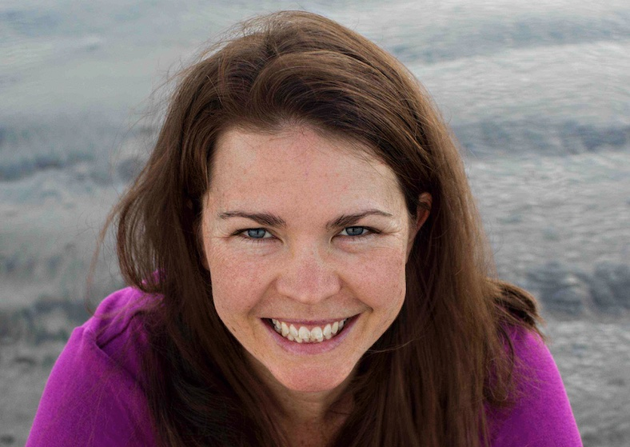
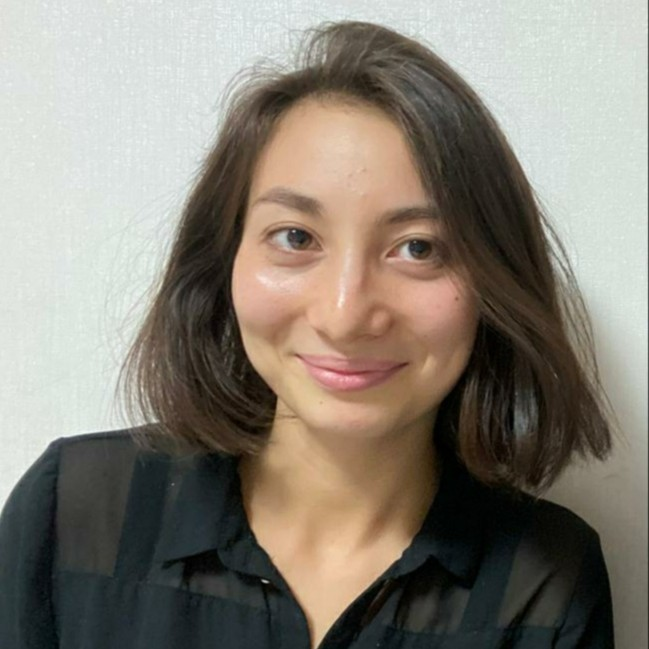

```{r setup, include=FALSE}
knitr::opts_chunk$set(echo = TRUE)
```

## Thank You for Joining Us!

<span style="font-size: 20px; font-weight: bold;">**Time: 2 minutes**</span> <br>
<span style="font-size: 20px; font-weight: bold;">**Led by: Lauren Chenarides**</span>

We are delighted to have you participate in this workshop, aimed at exploring a prototype dashboard, funded by the USDA, to track data usage statistics for USDA datasets. The USDA and their partners are developing a dashboard to track *who* and *how* USDA-produced datasets are used by the public, an initiative inspired by the [Foundations for Evidence-Based Policymaking Act of 2018](https://www.congress.gov/bill/115th-congress/house-bill/4174). The purpose of this workshop is to collect feedback from prospective users of the dashboard, and to use these comments to refine and improve the dashboard to better serve the needs of the research community.

### A Special Welcome from Julia Lane

<span style="font-size: 20px; font-weight: bold;">**Time: 3 minutes**</span> <br>

`r htmltools::HTML('<div style="display: flex; justify-content: left-align;"><div style="text-align: center; margin: 10px;"><br><a target="_blank" href="https://julialane.org/" style="font-size: 16px; font-weight: bold;">Julia Lane</a></div></div>')`


### Why Your Participation Matters

**Research Value**: Your engagement is central to the development process. As a research-oriented agricultural economist, your insights and feedback will directly influence the development of this platform, ensuring it aligns with the actual needs of the community. Your contributions today will inform the platform’s future enhancements, making it more intuitive and valuable for researchers like you.

**Networking and Knowledge Sharing Value**: This workshop is designed to be interactive and discussion-based, bringing together research-active agricultural economists. It represents a unique opportunity to connect, share knowledge, and learn from your peers—some of whom you may already know and others you are yet to meet. We hope these interactions foster a sense of community and collaboration.

**Community Impact**: The exclusivity of this workshop, limited to 40 agricultural economists, highlights the curated nature of this event. Your nomination to participate is a testament to the value we believe you bring to these discussions. Together, we have the potential to shape a tool that will serve not just our immediate needs but also set a benchmark for data discovery and application in policy oriented research.

## Workshop Details

### Team Introductions

<span style="font-size: 20px; font-weight: bold;">**Time: 3 minutes**</span> <br>
<span style="font-size: 20px; font-weight: bold;">**Led by: Allie Bauman**</span>

The workshop is being led by a team from Colorado State University: 

<div style="display: flex; flex-wrap: wrap; justify-content: center;">
<div style="text-align: center; margin: 10px;">
  
  <br>
  <a href="https://scholar.google.com/citations?user=KsJSnW4AAAAJ&hl=en" target="_blank" style="font-size: 16px; font-weight: bold;">Allie Bauman</a>
</div>
<div style="text-align: center; margin: 10px;">
  
  <br>
  <a href="https://www.linkedin.com/in/brookeannefitzgerald/" target="_blank" style="font-size: 16px; font-weight: bold;">Brooke Fitzgerald</a>
</div>
<div style="text-align: center; margin: 10px;">
  
  <br>
  <a href="https://scholar.google.com/citations?user=5epEG0wAAAAJ&hl=en" target="_blank" style="font-size: 16px; font-weight: bold;">Rebecca Cleary</a>
</div>
<div style="text-align: center; margin: 10px;">
  
  <br>
  <a href="https://scholar.google.com/citations?user=9xUKUroAAAAJ&hl=en&oi=ao" target="_blank" style="font-size: 16px; font-weight: bold;">Ta&iacute;s de Menezes</a>
</div>
<div style="text-align: center; margin: 10px;">
  
  <br>
  <a href="https://scholar.google.com/citations?user=TYjq1G4AAAAJ&hl=en" target="_blank" style="font-size: 16px; font-weight: bold;">Alessandro Bonanno</a>
</div>
<div style="text-align: center; margin: 10px;">
  
  <br>
  <a href="https://www.linkedin.com/in/mackenzie-gill/" target="_blank" style="font-size: 16px; font-weight: bold;">Mackenzie Gill</a>
</div>
<div style="text-align: center; margin: 10px;">
  
  <br>
  <a href="https://www.linkedin.com/in/laurenchenarides/" target="_blank" style="font-size: 16px; font-weight: bold;">Lauren Chenarides</a>
</div>
<div style="text-align: center; margin: 10px;">
  
  <br>
  <a href="https://www.linkedin.com/in/sionegael-ikeme-486aa9180/?locale=en_US" target="_blank" style="font-size: 16px; font-weight: bold;">Sione Ikeme</a>
</div>
<div style="text-align: center; margin: 10px;">
  
  <br>
  <a href="https://www.linkedin.com/in/mayla-boguslav-phd-30402239/" target="_blank" style="font-size: 16px; font-weight: bold;">Mayla Boguslav</a>
</div>
</div>

### Workshop Etiquette

<span style="font-size: 20px; font-weight: bold;">**Time: 1 minute**</span> <br>
<span style="font-size: 20px; font-weight: bold;">**Led by: Rebecca Cleary**</span>

To ensure a smooth and productive workshop experience for everyone, please follow these Zoom etiquette guidelines:

1. Keep video on when possible (particularly in the breakout rooms). Keeping your video on helps maintain engagement and create a more interactive environment.

2. Use the "Raise Hand" feature to ask questions or make comments. The discussant will call on you when it's your turn.

3. Be on mute unless you're speaking. This helps reduce background noise and ensure that the speaker is heard clearly.

4. Please respect the contributions of others and avoid interrupting when someone else is speaking.

5. If you have questions or need further explanation, please use the chat feature to ask for clarification.


### Breakout Groups

<span style="font-size: 20px; font-weight: bold;">**Time: 1 minute**</span> <br>
<span style="font-size: 20px; font-weight: bold;">**Led by: Rebecca Cleary**</span>

The majority of the workshop will be spent in breakout groups. You will be assigned to one of four breakout groups. Assignments are based on your research area or sub-discipline specialty. Participants will take part in two activities within their breakout rooms. All participants will reconvene to share their experience toward the end of the workshop. The workshop moderator will keep track of time and inform breakout groups how much time remains within the breakout rooms.

Each breakout group will have a discussant and a note taker, assigned below:

| Breakout Group   | Discussant | Note Taker | 
|--------|----------------|----------------|
| Group 1  |   Allie Bauman  |  Brooke Fitzgerald    |
| Group 2  |   Becky Cleary      |  Ta&iacute;s de Menezes  |
| Group 3  |   Alessandro Bonanno    |   Mackenzie Gill  |
| Group 4  |   Lauren Chenarides   | Sione Ikeme   |
| Moderator  |   Mayla Boguslav   |    |


**We value your perspective in shaping the development of a tool. We look forward to your active participation, insightful discussions, and feedback during this workshop.**

***Please hang tight, as you will now be moved into to your breakout rooms.***


<!-- ################## -->

<div style="padding-bottom: 60px;"></div>

<!--===================================-->
<div style="text-align: center;">
  <a href="breakout.html" class="btn" style="background-color: black; color: white; padding: 10px 20px; text-align: center; text-decoration: none; display: inline-block;">Go to Breakout Group Activities</a>
</div>

<!-- Back to Top Button 
<div id="back-to-top" style="position: fixed; bottom: 20px; right: 20px; display: none;">
  <a href="#top" onclick="document.body.scrollTop = 0; document.documentElement.scrollTop = 0; return false;" style="text-decoration: none; color: white; background-color: black; padding: 10px;">Back to Top</a>
</div>

<script>
window.onscroll = function() {scrollFunction()};

function scrollFunction() {
  if (document.body.scrollTop > 20 || document.documentElement.scrollTop > 20) {
    document.getElementById("back-to-top").style.display = "block";
  } else {
    document.getElementById("back-to-top").style.display = "none";
  }
}
</script>
-->